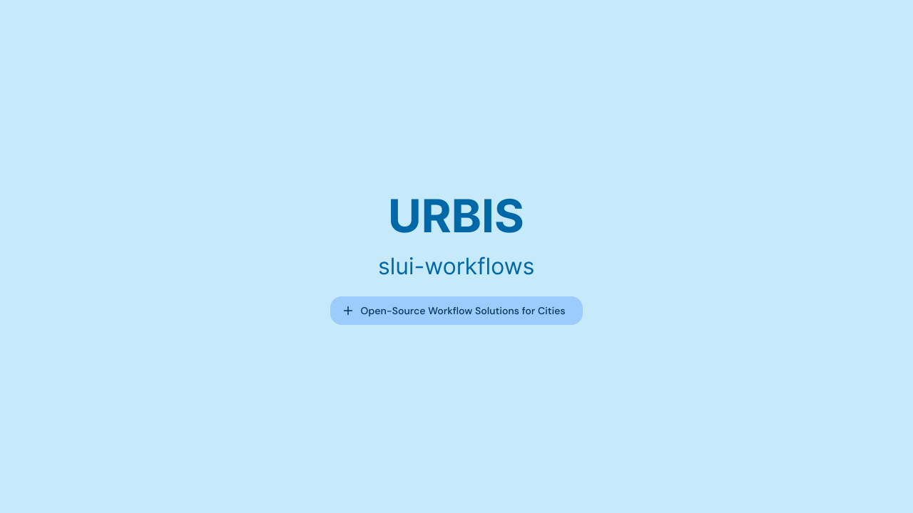

# Commit Message Guidelines



We follow a specific commit message format, inspired by Angular, to keep the history clear and enable automated changelog generation. Each commit message should follow this structure:

### Header Format

```
<type>(<scope>): <short summary>
```

- **Type**: Must be one of the following:

  - `build`: Changes to the build system or dependencies.
  - `ci`: Changes to CI configuration.
  - `docs`: Documentation-only changes.
  - `feat`: A new feature.
  - `fix`: A bug fix.
  - `perf`: A performance improvement.
  - `refactor`: A code change that neither fixes a bug nor adds a feature.
  - `test`: Adding or fixing tests.

- **Scope**: Optional. Indicates the part of the project affected (e.g., `client`, `docs`, `tests`).

- **Summary**: A brief description in the imperative mood (e.g., "add feature" not "added feature").

### Body (Optional)

- Explains **why** the change was made.
- Use the imperative mood (e.g., "fix" not "fixed").
- Required for all commits except those of type `docs`.

### Footer (Optional)

- Used to note _breaking changes_ or reference _issues_/PRs.
- For _breaking changes_, start with `BREAKING CHANGE: ` followed by a description.

### Full Example

```
feat(client): add new workflow component

This commit introduces a component for managing workflows, enhancing the user experience.

BREAKING CHANGE: The old workflow API is discontinued. Update to the new component.
```

### Reverting Commits

If reverting a previous commit, start the message with `revert: ` followed by the header of the reverted commit. Example:

```
revert: feat(client): add new workflow component

This reverts commit abc123.
```
